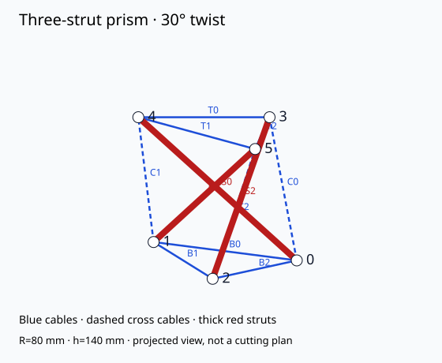

# Lesson 20: Corrosion, fatigue and inspection

[Course contents](../../../../COURSE.md) · Phase 04: Materials and failure

## Objective

Create an inspection plan tied to failure modes.

**Prerequisite:** Lesson 19; or demonstrate its evidence check.

**Planning time:** approximately 240 minutes including practice and recording. Split into short sessions as needed.

## Concept

Corrosion can reduce material section or damage connections; fatigue involves damage under repeated cycles. A new model’s single static test says little about long-term behavior. Inspection should name the component, possible defect, method, action and responsible person. Do not infer outdoor suitability from an indoor classroom kit.

## Worked example

For C0, a plausible mode is cord fraying near a sharp attachment. Inspection: look for broken fibers before each classroom session. Action: release the model safely, replace the component and retest the joint. This is more useful than “check the structure.”

## Materials and setup

Prism drawing, sample undamaged cord, templates/inspection.csv.

Use a private copy of the [experiment record](../../../../templates/experiment.md). Assign a specimen or activity ID and record which values are measured, calculated or illustrative.

## Predict and practice

Before acting, write the result you expect and one observation that could disagree with it.

1. List one plausible failure mode for cable, strut and joint.
2. For each, write a detectable sign and inspection method.
3. Set a pre-session classroom check and a response to defects.
4. Explain what additional evidence outdoor salt, heat and UV exposure would require.
5. Assign an owner for the inspection record.

## Expected behavior and interpretation

Every identified defect has an action rather than an observation without follow-up.

If your result differs, keep it. Recheck units, endpoint definitions, instruments and assumptions before changing the design. A mismatch can be the most useful evidence.

## Troubleshooting and limits

Visual inspection cannot detect every internal defect or predict service life. No lifetime rating is provided.

## Teach-back quiz

1. What is fatigue related to?
2. Does one static test establish durability?
3. What must an inspection include besides a defect?

[Facilitator answer key](../../../../assessments/phase-04-answers.md) — attempt the questions first.

## Evidence to submit

Three-component inspection plan with actions.

Include your prediction, setup, results with units or criteria, and one limitation. Use the [rubric](../../../../assessments/RUBRIC.md): demonstrate each applicable dimension at level 2 or above before progressing. Numerical examples count as calculation evidence; they are not physical test results.

## Facilitator adaptation

Offer a sketch, demonstration or pointing response as alternatives to speech. Provide pre-labeled parts, shorter sessions or a quiet workspace if chosen by the learner. Preserve the objective while adapting unnecessary task demands.

## Reading and provenance

See [source notes](../../../../references/README.md). This lesson is original course material. Hypothetical numbers are teaching examples; no field deployment or institutional endorsement is implied.
