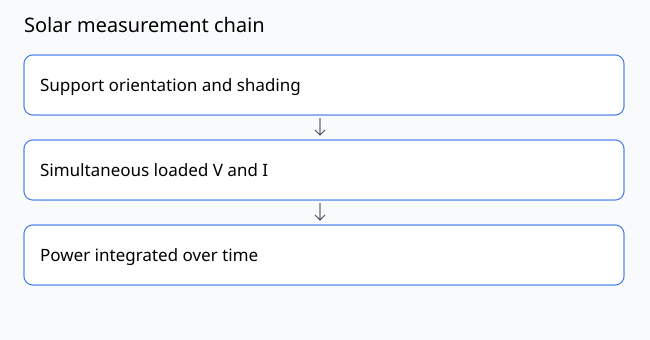

# Lesson 30: Rooftop load paths and maintenance

[Course contents](../../../../COURSE.md) · Phase 07: Solar and Singapore applications

## Objective

Turn a rooftop idea into a reviewable concept with access and load-path questions.

**Prerequisite:** Lesson 29; or demonstrate its evidence check.

**Planning time:** approximately 270 minutes including practice and recording. Split into short sessions as needed.

## Concept

A rooftop installation transfers gravity, wind and other actions to the building through attachments or ballast. It also affects waterproofing, drainage, access, fire-related considerations and maintenance. A tabletop model is a communication tool, not evidence that an HDB roof can accept an installation. Requirements depend on the actual site and current authorities.

## Worked example

A concept places a sculpture across a roof access route. Even if its ideal members balance, it fails the maintenance-use case. Moving it requires rechecking attachment positions, shading and load paths; aesthetics alone do not determine feasibility.

## Materials and setup

A fictional roof plan, paper and templates/site-review.md. No roof access is part of this lesson.

Use a private copy of the [experiment record](../../../../templates/experiment.md). Assign a specimen or activity ID and record which values are measured, calculated or illustrative.

## Predict and practice

Before acting, write the result you expect and one observation that could disagree with it.

1. Draw a fictional roof with parapet, drain and access route.
2. Place a dummy concept and mark gravity/uplift transfer points.
3. Draw the panel-replacement route and a way to inspect joints.
4. List missing roof, attachment, electrical and ownership information.
5. Mark review gates and responsible professional roles without inventing approvals.

## Expected behavior and interpretation

The concept includes access, drainage and structural information needs as first-class design inputs.

If your result differs, keep it. Recheck units, endpoint definitions, instruments and assumptions before changing the design. A mismatch can be the most useful evidence.

## Troubleshooting and limits

Never visit or install on a roof as a classroom exercise. Do not invent current statutory requirements or approval status.

## Teach-back quiz

1. Where must rooftop forces go?
2. Does a tabletop model establish roof capacity?
3. Name a nonstructural maintenance consideration.

[Facilitator answer key](../../../../assessments/phase-07-answers.md) — attempt the questions first.

## Evidence to submit

An annotated fictional roof concept and review checklist.

Include your prediction, setup, results with units or criteria, and one limitation. Use the [rubric](../../../../assessments/RUBRIC.md): demonstrate each applicable dimension at level 2 or above before progressing. Numerical examples count as calculation evidence; they are not physical test results.

## Facilitator adaptation

Offer a sketch, demonstration or pointing response as alternatives to speech. Provide pre-labeled parts, shorter sessions or a quiet workspace if chosen by the learner. Preserve the objective while adapting unnecessary task demands.

## Reading and provenance

See [source notes](../../../../references/README.md). This lesson is original course material. Hypothetical numbers are teaching examples; no field deployment or institutional endorsement is implied.
