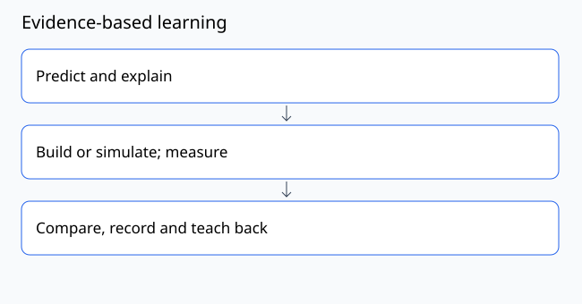

# Lesson 38: Sensory and motor adaptations

[Course contents](../../../../COURSE.md) · Phase 09: Accessible teaching and workforce skills

## Objective

Adapt the activity while preserving its learning objective.

**Prerequisite:** Lesson 37; or demonstrate its evidence check.

**Planning time:** approximately 180 minutes including practice and recording. Split into short sessions as needed.

## Concept

Access can involve quieter space, predictable instructions, pre-cut parts, larger labels, assembly jigs, breaks or a partner. Ask what the learner prefers rather than treating a diagnosis as a complete profile. Separate the mechanics objective from unnecessary dexterity demands. Pointing or demonstration can show understanding without a spoken presentation.

## Worked example

Objective: identify tension members. A learner who finds knots difficult can use a preassembled model and point to labeled cables. Knot-tying performance should not determine the score for force identification.

## Materials and setup

Activity plan, support-choice cards and a preassembled model if available.

Use a private copy of the [experiment record](../../../../templates/experiment.md). Assign a specimen or activity ID and record which values are measured, calculated or illustrative.

## Predict and practice

Before acting, write the result you expect and one observation that could disagree with it.

1. Name one core learning objective and one nonessential task demand.
2. Offer two support choices and a way to request a change.
3. Provide a quiet or low-stimulation alternative where possible.
4. Let the learner demonstrate understanding in a chosen form.
5. Record which supports helped without collecting unnecessary diagnostic information.

## Expected behavior and interpretation

Assessment captures the intended concept while access choices remain flexible.

If your result differs, keep it. Recheck units, endpoint definitions, instruments and assumptions before changing the design. A mismatch can be the most useful evidence.

## Troubleshooting and limits

Do not claim this course treats autism or guarantees therapeutic benefit. Institutional pilots require educator and participant involvement.

## Teach-back quiz

1. Does knot difficulty imply poor structural understanding?
2. Name an alternative to a spoken answer.
3. Who should help select adaptations?

[Facilitator answer key](../../../../assessments/phase-09-answers.md) — attempt the questions first.

## Evidence to submit

An adapted activity with a concept-aligned assessment.

Include your prediction, setup, results with units or criteria, and one limitation. Use the [rubric](../../../../assessments/RUBRIC.md): demonstrate each applicable dimension at level 2 or above before progressing. Numerical examples count as calculation evidence; they are not physical test results.

## Facilitator adaptation

Offer a sketch, demonstration or pointing response as alternatives to speech. Provide pre-labeled parts, shorter sessions or a quiet workspace if chosen by the learner. Preserve the objective while adapting unnecessary task demands.

## Reading and provenance

See [source notes](../../../../references/README.md). This lesson is original course material. Hypothetical numbers are teaching examples; no field deployment or institutional endorsement is implied.
